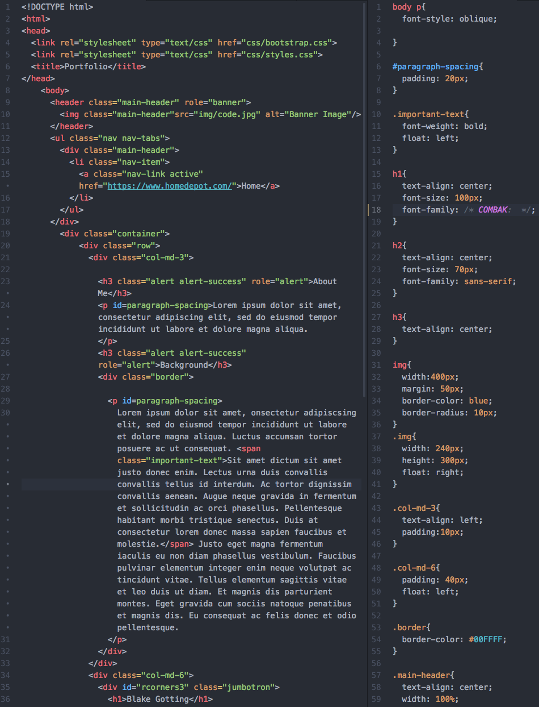

# Portfolio Project
### HTML and CSS Exercise for Epicodus

**By Blake Gotting**

## Description
End of week one project to prove basic understanding of this week's concepts. A basic website built using week one spacial techniques such as floats, columns, classes, etc.

### GH-pages link
https://github.com/brgotting/my-portfolio/tree/gh-pages

## Setup
Clone this repository.

## Tech Used
HTML

CSS

Bootstrap

Atom

## Legal
Copyright (c) 2018 Blake Gotting

## License
MT
